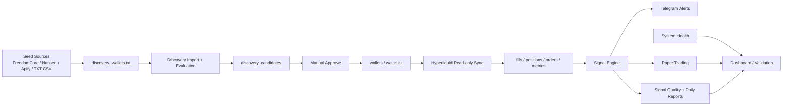

# NOVAION Smart Money Agent - Architecture

Date: 2026-06-13

## Product Boundary

NOVAION Smart Money Agent is a read-only Smart Money research and paper-following tool for Hyperliquid. It does not connect private keys and does not place real trades. All live-trading settings are display-only guards in this MVP.

## High-Level Architecture

## Backend

- Framework: Python FastAPI
- Database: SQLite through SQLAlchemy
- Auth: JWT
- Scheduler: APScheduler
- HTTP client: `httpx` for app services, standard library for standalone seed fetch script
- Notification: Telegram Bot
- Deployment: Docker Compose

Main API routers:

- `/api/auth`
- `/api/dashboard`
- `/api/wallets`
- `/api/market-data`
- `/api/signals`
- `/api/quality`
- `/api/discovery`
- `/api/system`
- `/api/validation`

## Frontend

- Primary intended stack: React + Vite + Tailwind in `apps/web`
- Static internal-test frontend: `apps/web-static/index.html`
- Current practical test surface: static frontend on port `5173`

## Core Data Flow

1. Seed wallets are collected by `scripts/fetch_seeds.py`.
2. Seed wallet addresses are written to `apps/api/data/discovery_wallets.txt`.
3. Discovery imports and evaluates candidates using Hyperliquid public endpoints.
4. Recommended candidates require manual approval before entering watchlist.
5. Active wallets are synced every scheduler cycle.
6. Fills and position snapshots produce wallet metrics and signals.
7. Signals may trigger Telegram alerts and paper trades.
8. Signal outcomes feed quality dashboards and daily reports.

## Main Tables

- `wallets`
- `wallet_metrics`
- `wallet_fills`
- `wallet_position_snapshots`
- `wallet_order_snapshots`
- `sync_states`
- `signals`
- `signal_performance`
- `paper_trades`
- `risk_rules`
- `daily_reports`
- `discovery_candidates`
- `discovery_runs`
- `task_locks`
- `hyperliquid_api_metrics`
- `system_logs`

## Safety Architecture

- Private keys are not accepted.
- Real trading is not implemented.
- `ENABLE_LIVE_TRADING=false` by default.
- `EMERGENCY_STOP=true` by default.
- Discovery auto-add is disabled by default.
- Recommended candidates require manual approval.
- Seed source writes only to seed file, not watchlist.
- Paper trading caps size, leverage, and risk.
- Telegram ops alerts include cooldown.
- Task locks include heartbeat for long-running jobs.

## External Integrations

- Hyperliquid public `/info` endpoint
- Telegram Bot API
- FreedomCore Arena public leaderboard
- Optional Nansen API if `NANSEN_API_KEY` is configured
- Optional Apify actor if `APIFY_TOKEN` is configured
- Local TXT/CSV fallback for seed wallets

## Known Architectural Constraints

- SQLite is acceptable for 3-5 person internal testing but not for high-concurrency production.
- Hyperliquid ROI/PnL metrics are estimated from public data and must be labeled as estimates.
- Discovery quality depends heavily on seed source quality.
- Scheduler must be running for continuous validation.
- Telegram must be configured before real internal testing.
